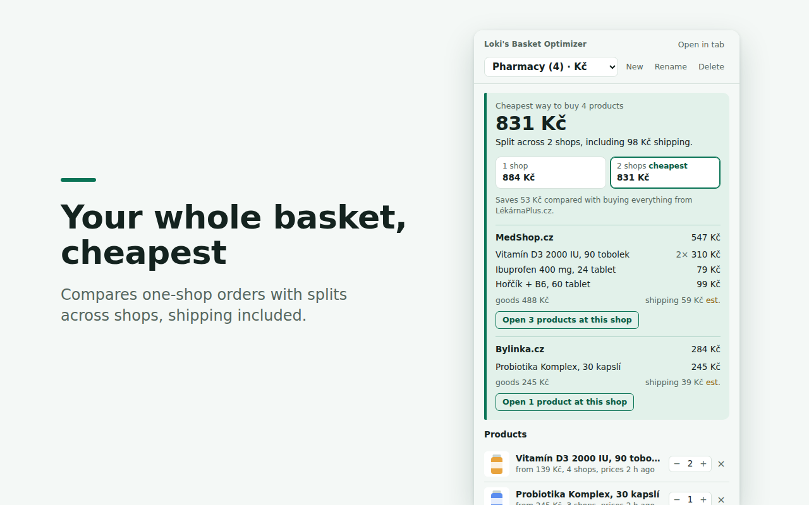

# Loki's Basket Optimizer

**Find the cheapest way to buy your whole basket on Heureka and Zboží, shipping included.**

Price comparison sites show the cheapest shop for *one* product. But when you buy vitamins,
probiotics and a painkiller, the cheapest shop is often different for each, and three
shipping fees eat the savings. This browser extension collects the products you want and
calculates the cheapest combination: everything from one shop, or split across two or three,
with shipping and free-shipping limits taken into account.



## Features

- **Whole-basket optimization**: compares the best one-shop order with splits across 2–3 shops
  and shows exactly how much splitting saves (or that it doesn't).
- **Shipping-aware**: uses each shop's delivery price and free-shipping limit. Limits are
  estimated from the site; you can enter the real values once and they are remembered.
- **Heureka.cz, Heureka.sk and Zboží.cz**: the same shop on Heureka and Zboží counts as one
  shop, and the same product found on both sites can be combined to see every shop's offer.
- **Several baskets** (pharmacy, electronics, …); Kč and € baskets are kept separate.
- Flags shops that only offer **pickup in their own store**, and shows shops that are
  (almost) as cheap as the winner.
- **Czech, Slovak and English** interface.
- **Private**: no account, no tracking, no server; everything stays in your browser.

## How to use

1. Open a product on Heureka or Zboží. A green **Add to "…"** button appears in the
   bottom-left corner of the page. Click it: the extension reads all the shop offers.
2. Repeat for every product you want to buy. The **▾** next to the button switches baskets
   or adds the page's offers to a product already in the basket.
3. Click the extension's toolbar icon to see the cheapest plan, and **Open products at this
   shop** to go straight to the offers.
4. Optional: under **Shipping rules**, type the real shipping fee and free-shipping limit of
   the shops you use most. That makes the result exact.

## Install

- **Chrome, Edge, Brave**: via the Chrome Web Store link (the listing is unlisted, so it is
  shared by link only).
- **Firefox 140+**: a signed `.xpi` file: open `about:addons`, click the gear icon,
  **Install Add-on From File…**.
- **From source**: download this repository, then in Chrome open `chrome://extensions`, turn on
  **Developer mode**, click **Load unpacked** and select the `extension/` folder.

## How it works

The extension only does something when you click its button on the product page you are
looking at. On Heureka it reads the offers on the page and opens the full list ("Zobrazit
další nabídky"). On Zboží it asks zbozi.cz for the product's offer list, the same request the
site makes when you click "Další obchody". The optimizer then finds the exact cheapest
assignment of products to shops (branch and bound, checked against brute force), counting
each shop's shipping once and applying free-shipping limits.

Prices are a snapshot from when you added a product; open it again and click **Update** to
refresh.

## Privacy

Your baskets, shipping rules and settings are stored only in your browser. The extension has
no server and sends nothing to its author. Details: [PRIVACY.md](PRIVACY.md).

## Development

Plain JavaScript, Manifest V3, no build step for the extension itself.

```
npm install
npm test          # unit tests
npm run lint      # Mozilla add-on linter
npm run build     # Chrome and Firefox store zips in dist/
npm run test:e2e  # browser tests (Python + Playwright, see CLAUDE.md)
```

Some tests use saved Heureka/Zboží pages, which are not part of the repository (they are
third-party content); without them those tests are skipped. See
[tests/fixtures/README.md](tests/fixtures/README.md).

[CLAUDE.md](CLAUDE.md) describes the architecture, how each site is read, known pitfalls,
the release checklist and ideas for future versions.

```
extension/   the add-on (manifest, content script, popup, lib/)
tests/       unit tests (Node) and browser tests (Playwright)
tools/       build script and store-image generator
store/       Chrome Web Store listing texts and images
```

## Česky

Rozšíření prohlížeče, které najde nejlevnější způsob, jak koupit celý košík produktů z
Heureky (.cz, .sk) a Zboží, **včetně dopravy**. Porovná nákup všeho v jednom obchodě
s rozdělením do 2–3 obchodů, počítá s dopravou zdarma od určité částky, umí více košíků
a stejný obchod na Heurece i Zboží bere jako jeden. Na stránce produktu klikněte na zelené
tlačítko vlevo dole, pak otevřete rozšíření z lišty prohlížeče. Všechna data zůstávají ve
vašem prohlížeči.

## Disclaimer

This is an independent personal project. It is not affiliated with, endorsed by or
connected to Heureka Group a.s., Seznam.cz a.s. (Zboží.cz) or any of the shops. All names
and trademarks belong to their owners. Prices and shipping costs are taken from the
comparison sites and the shops' own terms may differ, so always check the final price in
the shop before ordering.
